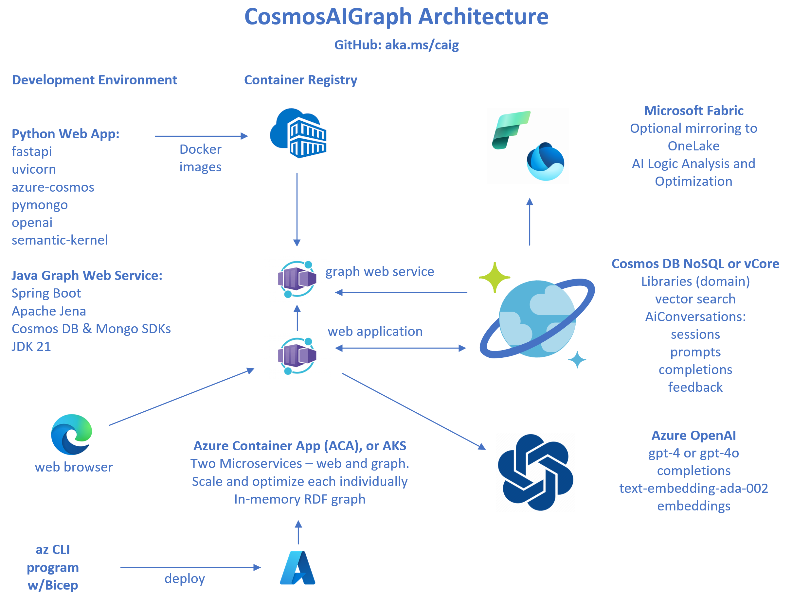

# CosmosAIGraph

**AI-Powered Graph and Knowledge Graph Solutions with Azure Cosmos DB and the OmniRAG pattern**

- [Azure Cosmos DB TV, Episode 95 Video](https://www.youtube.com/watch?v=0alvRmEgIpQ)
- [Presentations](presentations/)
- [Architecture Diagram](impl/docs/img/app-architecture-v2.png)
- [Reference Application Documentation](impl/docs/readme.md)
- [Implementation Code, Python](impl/app)
- [Bicep Deployment Scripts](impl/deployment)
- [Reference Dataset of Python libraries, pre-vectorized](impl/data/pypi/wrangled_libs)
- [Frequently Asked Questions (FAQ)](impl/docs/faq.md)

<pre>

</pre>

  

---

## Change Log

- January 2025
  - Added the **Java and Apache Jena** implementation of the in-memory graph
  - See https://jena.apache.org/index.html

- September 2024
  - Added support for the **Cosmos DB NoSql API** in addition to Cosmos DB Mongo vCore
  - Migrated to this public repo https://github.com/AzureCosmosDB/CosmosAIGraph

## Roadmap

- Add RBAC and Microsoft Entra ID/AAD authentication support for the **Cosmos DB NoSql API**
- Update Azure OpenAI model from gpt-4
- Generic Graph Examples

## Contributing

This project welcomes contributions and suggestions.  Most contributions require you to agree to a
Contributor License Agreement (CLA) declaring that you have the right to, and actually do, grant us
the rights to use your contribution. For details, visit https://cla.opensource.microsoft.com.

When you submit a pull request, a CLA bot will automatically determine whether you need to provide
a CLA and decorate the PR appropriately (e.g., status check, comment). Simply follow the instructions
provided by the bot. You will only need to do this once across all repos using our CLA.

This project has adopted the [Microsoft Open Source Code of Conduct](https://opensource.microsoft.com/codeofconduct/).
For more information see the [Code of Conduct FAQ](https://opensource.microsoft.com/codeofconduct/faq/) or
contact [opencode@microsoft.com](mailto:opencode@microsoft.com) with any additional questions or comments.

## Trademarks

This project may contain trademarks or logos for projects, products, or services.
Authorized use of Microsoft  trademarks or logos is subject to and must follow 
[Microsoft's Trademark & Brand Guidelines](https://www.microsoft.com/en-us/legal/intellectualproperty/trademarks/usage/general).
Use of Microsoft trademarks or logos in modified versions of this project must
not cause confusion or imply Microsoft sponsorship.
Any use of third-party trademarks or logos are subject to those third-party's policies.
