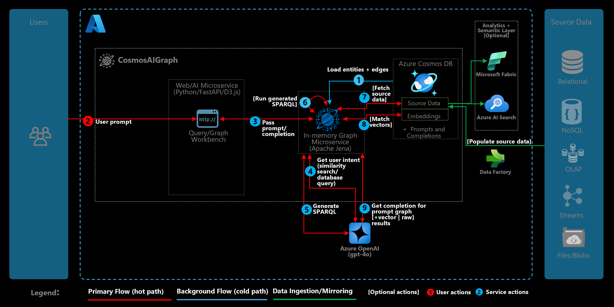
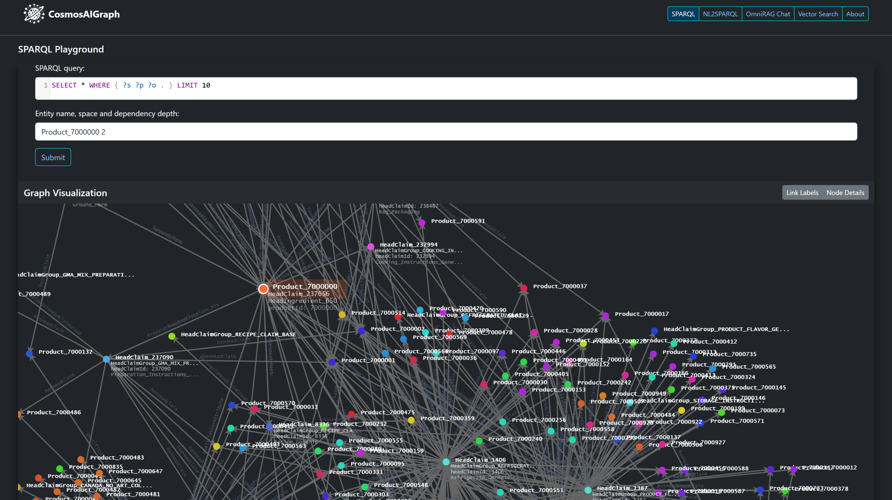

# CosmosAIGraph

**AI-Powered implementation of OmniRAG pattern, utilizing Azure Cosmos DB with DiskANN Vector/Hybrid Search and Apache Jena in-memory graph database**

- [OmniRAG Pattern Overview](presentations/OmniRAG%20Pattern%20and%20CosmosAIGraph%20Implementation.pdf)
- [Quickstart and deployment](docs/readme.md)
- [Frequently Asked Questions (FAQ)](docs/faq.md)
- [Reference Dataset of Python libraries](data/pypi/wrangled_libs)

## CosmosAIGraph Deployment Architecture

  

## CosmosAIGraph Solution Architecture

  

---

## Release Notes (September 2025)
- Rich conversation history with auto or manual source selection and with local/database session state persistence:
 

  

- Generic graph visualization (takes into account loaded custom ontology/graph data):

  

- Generic ontology visualization:

  

- Rich editors for OWL/TTL/SPARQL with color syntax highlighting:
 

  

 Comprehensive vector/full-text/hybrid search to cover semi-structured data:
 

  

## Contributing

This project welcomes contributions and suggestions.  Most contributions require you to agree to a
Contributor License Agreement (CLA) declaring that you have the right to, and actually do, grant us
the rights to use your contribution. For details, visit https://cla.opensource.microsoft.com.

When you submit a pull request, a CLA bot will automatically determine whether you need to provide
a CLA and decorate the PR appropriately (e.g., status check, comment). Simply follow the instructions
provided by the bot. You will only need to do this once across all repos using our CLA.

This project has adopted the [Microsoft Open Source Code of Conduct](https://opensource.microsoft.com/codeofconduct/).
For more information see the [Code of Conduct FAQ](https://opensource.microsoft.com/codeofconduct/faq/) or
contact [opencode@microsoft.com](mailto:opencode@microsoft.com) with any additional questions or comments.

## Trademarks

This project may contain trademarks or logos for projects, products, or services.
Authorized use of Microsoft  trademarks or logos is subject to and must follow 
[Microsoft's Trademark & Brand Guidelines](https://www.microsoft.com/en-us/legal/intellectualproperty/trademarks/usage/general).
Use of Microsoft trademarks or logos in modified versions of this project must
not cause confusion or imply Microsoft sponsorship.
Any use of third-party trademarks or logos are subject to those third-party's policies.
