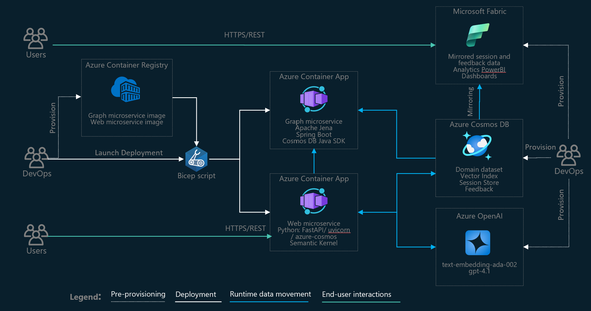

# CosmosAIGraph

**AI-Powered implementation of OmniRAG pattern, utilizing Azure Cosmos DB with DiskANN Vector/Hybrid Search and Apache Jena in-memory graph database**

- [OmniRAG Pattern Overview](presentations/OmniRAG%20Pattern%20and%20CosmosAIGraph%20Implementation.pdf)
- [Quickstart and deployment](docs/readme.md)
- [Frequently Asked Questions (FAQ)](docs/faq.md)
- [Reference Dataset of Python libraries](data/pypi/wrangled_libs)

## What is OmniRAG Pattern?

OmniRAG pattern is advanced Retrieval Augmented Generation pattern, helping to acheieve maximum relevancy of the results in context retrieval by detecting the user inten, intellegently routing the reqest to multiple available data sources and collecting the results from them before calling the completion model. OmniRAR core tenets are:

- Omni-source with data virtualization
  - Not limited to vector store, utilizing ALL data sources that can bring value to the context for AI
  - Use data wherever it is, in the original format, minimizing data movement and transformation
- Knowledge graph
  - Contains entities/relationships from existing data to make it readily available for AI to reason over (along with original data) 
- User intent detection
  - Allows automatic routing of user’s query to the right source, leverages AI
- Runtime NL2Query conversion
  - Converts user query to the source’s query language using simple utterance analysis and/or AI  
- Session analytics
  - Required to fine-tune golden dataset of questions + intent so the intent detection doesn't degrade as data variety and volume grows. Additionally, it could be used for semantic cache generation/curation.

 

  

## CosmosAIGraph Deployment Architecture

  

## CosmosAIGraph Solution Architecture

  

---

## Release Notes (September 2025)
- Rich conversation history with auto or manual source selection and with local/database session state persistence:
 

  

- Generic graph visualization (takes into account loaded custom ontology/graph data):

  

- Generic ontology visualization:

  

- Rich editors for OWL/TTL/SPARQL with color syntax highlighting:
 

  

 Comprehensive vector/full-text/hybrid search to cover semi-structured data:
 

  

## Contributing

This project welcomes contributions and suggestions.  Most contributions require you to agree to a
Contributor License Agreement (CLA) declaring that you have the right to, and actually do, grant us
the rights to use your contribution. For details, visit https://cla.opensource.microsoft.com.

When you submit a pull request, a CLA bot will automatically determine whether you need to provide
a CLA and decorate the PR appropriately (e.g., status check, comment). Simply follow the instructions
provided by the bot. You will only need to do this once across all repos using our CLA.

This project has adopted the [Microsoft Open Source Code of Conduct](https://opensource.microsoft.com/codeofconduct/).
For more information see the [Code of Conduct FAQ](https://opensource.microsoft.com/codeofconduct/faq/) or
contact [opencode@microsoft.com](mailto:opencode@microsoft.com) with any additional questions or comments.

## Trademarks

This project may contain trademarks or logos for projects, products, or services.
Authorized use of Microsoft  trademarks or logos is subject to and must follow 
[Microsoft's Trademark & Brand Guidelines](https://www.microsoft.com/en-us/legal/intellectualproperty/trademarks/usage/general).
Use of Microsoft trademarks or logos in modified versions of this project must
not cause confusion or imply Microsoft sponsorship.
Any use of third-party trademarks or logos are subject to those third-party's policies.
