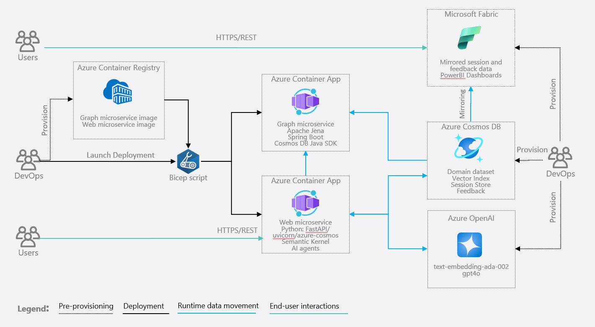

# CosmosAIGraph : Application Architecture

  

---

## Application Components

- Microservices:
  - Web app - UI front end with AI functionality
  - Graph app - Contains the in-memory graph
- Azure Container Apps - Runtime orchestrator for the above two microservices
- Azure Cosmos DB for NoSQL - Domain data and conversational AI documents, embeddings
- Azure OpenAI - completion and embedding models

