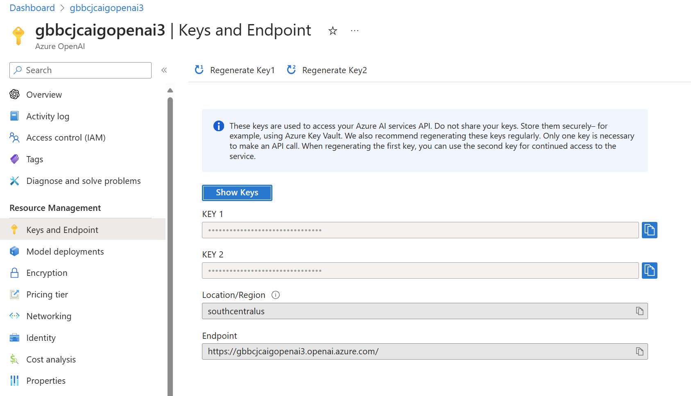
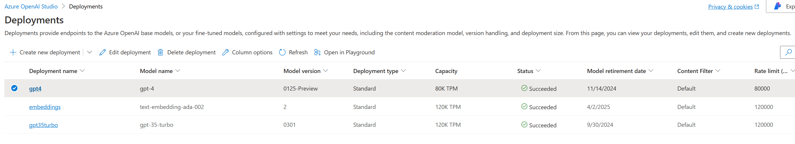
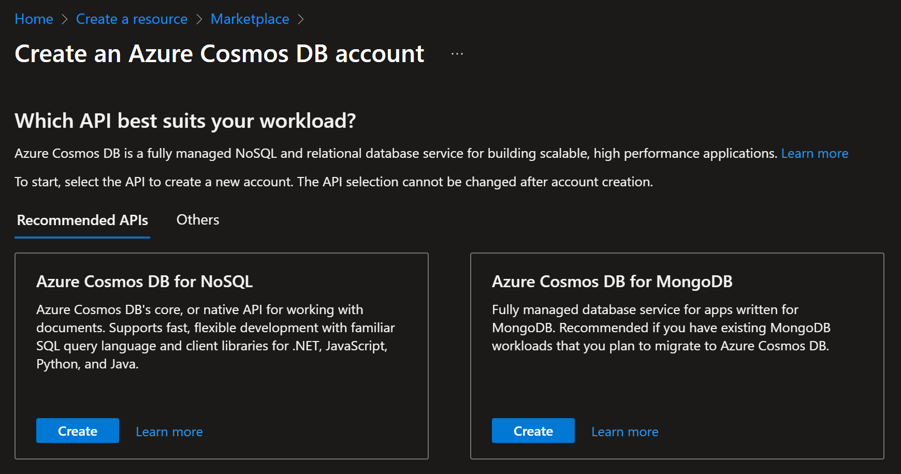
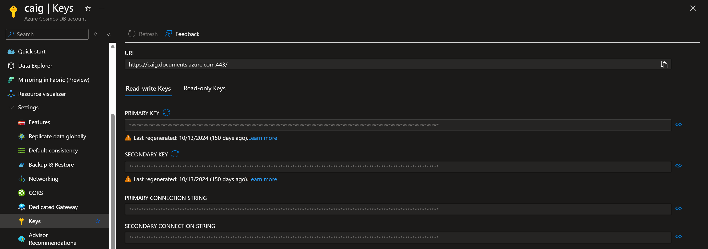

# CosmosAIGraph : Initial PaaS Provisioning

Though the provisioning of Azure PaaS services can be fully automated,
it is recommended that you deploy **Azure OpenAI** and **Azure Cosmos DB for NoSQL**
manually in your subscription for this reference application.

The reason for this is that you may already have these resources deployed (i.e - Azure OpenAI)
and they may not be available in all regions.  Furthermore, you may face
Azure OpenAI model quota constraints.

## Azure OpenAI

In Azure Portal, go to Marketplace and search for "Azure OpenAI".
Proceed through the dialogs to provision this resource.

Once it is provisioned, navigate to the Resource Management -> Keys and Endpoint
page within the account as shown below.

  

Capture the values of the endpoint URL and Key 1.  You will later
set your **CAIG_AZURE_OPENAI_URL** and **CAIG_AZURE_OPENAI_KEY**
environment variables with these values.

Create model deployments for the **gpt-4** and **text-embedding-ada-002** models.
It is expected that, over time, the names of these models will change,
so use the current version of each.

  

You should set your **CAIG_AZURE_OPENAI_COMPLETIONS_DEP** and 
**CAIG_AZURE_OPENAI_EMBEDDINGS_DEP** environment variables to the
deployment names of these two models in your Azure OpenAI account.

## Azure Container Registry (ACR)

See https://learn.microsoft.com/en-us/azure/container-registry/.

When you build the Docker images for your application they should
be pushed to your ACR.

The example Bicep deployment scripts in this repository use
**DockerHub** for this public reference implementation.
However, you should use your private and secure Azure Container Registry instead.

## Azure Cosmos DB for NoSQL

In Azure Portal, go to Marketplace and search for "Azure Cosmos DB".
Select "Azure Cosmos DB" on the first page.

Then select "Azure Cosmos DB for NoSQL" on the second page as shown below:

  

### Obtain/Set the Connection Parameters

After the Azure Cosmos DB for NoSQL account has been created, 
save the name you chose for that account in the environment variable called **CAIG_COSMOSDB_NOSQL_ACCT**.

Also, set the environment variable called **CAIG_COSMOSDB_NOSQL_AUTH_MECHANISM** to "key".

Then, navigate to this account in your Azure Portal and open "Settings -> Keys" blade as shown below.  

  

Copy the **PRIMARY KEY** value into a the environment variable called **CAIG_COSMOSDB_NOSQL_KEY**.
