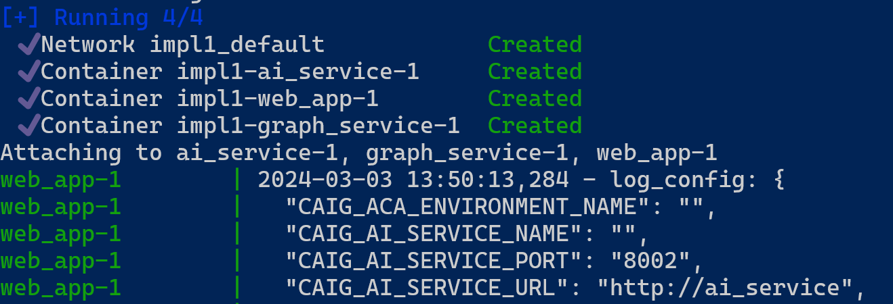

# CosmosAIGraph : Local Execution

These are the instructions for those who want to explore and
execute CosmosAIGraph on their workstation.

Other users may simply wish to deploy the pre-built Docker containers to an Azure Container App as described [here](aca_deployment.md).

## [Optional] Unzip file libraries-graph.zip

If you'd like to load the graph data from local file, follow these steps. Otherwise, the data is provided as part of Cosmos DB account which is populated with this data as described [here](load_cosmos_nosql.md).

The full-size libraries-graph.nt (N-triples) file is too large for GitHub.
Therefore it has been zipped and added to this repo as a file 
impl/app/rdf/libraries-graph.zip.  Navigate to this directory
and unzip this file to **impl/app/rdf/libraries-graph.nt**
.

## Modes of Execution

Three different modes of execution are recommended, please use the mode
most natural to your development style.

The three modes are:

- **App-per-Terminal** (Recommended)
- **Launcher Script**
- **Docker Compose**

## App-per-Terminal

In this mode, two Terminal windows are created each hosting its application - web and graph.

Before you run them, be sure to set your local environment variables, either by preparing an .env file, or by preparing and running **impl/set-caig-env-vars-sample.ps1** script, or just adding them manually.

Then be sure you have created Python virtual environment in the web app, by running **impl/web_app/venv.ps1** script.

To launch the terminals, simply run **impl/run.ps1** script.

## Docker Compose

This is the closest method to running your application to Azure.
This approach executes the application packaged as **Docker Containers** rather than as local files.

Start your **Docker Desktop** application if it's not already running.

Be sure to modify your environment variables in the appropriate
**docker-compose-xxx.yml** ile before starting the microservices.

The following docker-compose YAML file is provided:

- docker-compose-with-jena.yml 
  - This also uses the Python-based web application
  - This uses the Java-based graph microservice using Apache Jena

Create two PowerShell Terminal windows, and navigate to the **impl/app/** directory in each.

In the first terminal window, execute the following command to start the application (both microservices).

```
docker compose -f docker/docker-compose-with-jena.yml up
```

You should see similar verbose output that includes the following:

<p align="center">
  
</p>

---

In the second terminal window, execute the following command to terminate the application.

```
docker compose -f docker/docker-compose-with-jena.yml down
```

You should see similar verbose output that includes the following:

<p align="center">
  
</p>

---

### The Docker Containers

These three pre-built Docker containers exist on **DockerHub**:

- cjoakim/caig_web_v3:latest
- cjoakim/caig_graph_v3:latest
- cjoakim/caig_graph_java_jena_v1:latest

These are used by default by the above **docker-compose** scripts
and also by the **Azure Container App** deployment process.

If you wish to rebuild these containers and deploy them to your own
Container Registry, please see the following Dockerfiles in this repo.
You're free to modify these as necessary.
Please change the **cjoakim** prefix to your own identifier.

- impl/app/docker/Dockerfile_graph
- impl/app/docker/Dockerfile_web
- impl/java_jena_graph_websvc/Dockerfile
