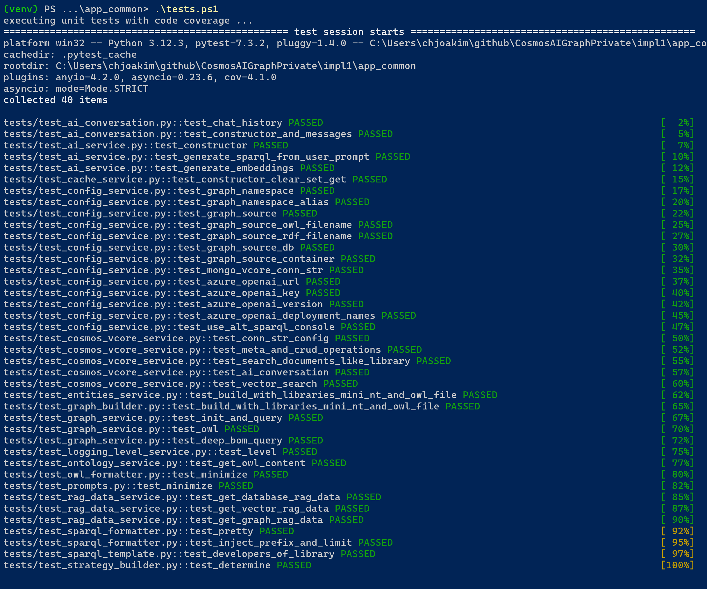

# CosmosAIGraph : Understanding the Code

This page strives to guide the users in understanding both
the structure and implementation of this project.  Not every
code module is described here, only the most important ones.

## The impl\app directory

**This directory contains the Python codebase.**

It contains these directories:

```
├── app               Application code and scripts
├── data              Data files, including the set of Python libraries
├── deployment        Bicep-based Azure Container App deployment scripts
└── docs              Documentation
```

## The impl\app directory

This is where the Python implementation code and scripts are.
It contains these directories.

```
├── docker              Dockerfiles and docker-compose yml files
├── keys                Future use
├── ontologies          OWL schema files, with *.owl file suffix
├── rdf                 RDF graph data files in "triples" format, with *.nt file suffix
├── sparql              Sample SPARQL RDF query statements and Jinja2 templates
├── src                 Python source code
│   ├── models
│   ├── services
│   └── util
├── static              Static files and images served by the web application
├── templates           Jinja2 templates for non-web use
├── tests               pytest unit tests
├── tmp                 Create this directory manually; it should be git-ignored
├── venv                Python virtual environment directory, created by venv.ps1 and venv.sh
└── views               Jinja2 templates used to render HTML pages in the web application
```

See the **tests.ps1** and **tests.sh** unit testing scripts.
Their output looks like the following:

<p align="center">
  
</p>

### impl\app\src\models directory

File **webservice_models.py** contains the several **Pydantic models** 
that define both the request and response payloads for the web endpoints
in this application.

Likewise, **internal_models.py** implements Pydantic Models used to
describe datastructures passed between classes in the application.

Pydantic models are somewhat like Java Interfaces in that they define
what an object should look like, but provide no implementation.
The FastAPI uses Pydantic models to generate endpoint documentation,
and IDEs also use them to provide type hints to the Developer.

### impl\app\src\services directory

The classes here define the **business service** logic used by the application.

**config_service.py** implements class **ConfigService** that is used by
the application for all configuration values.  "Hard-coding" of these
values is generally not done in this codebase.  It is a goal of this
reference implementation to expose as much functionality via configuration
and **environment variables** as possible.  See this class for the complete
list of environment variables used by this solution, they all begin with **CAIG_**.

**ConfigService** uses **environment variables** and this is well-suited for
**Docker** containerized applications that are deployed to environments such as 
**Azure Container Apps (ACA)** and **Azure Kubernetes Service (AKS)**.

The [python-dotenv](https://pypi.org/project/python-dotenv/) python library
is used in the codebase to optionally get environment variables via the **.env**
file.  The **.env** should not be stored in your source-control system, as
it may contain application secrets.

See the source code of this module; it lists all of the possible environment
variables used in the codebase.  They all begin with **CAIG_**.

**logging_level_service.py** defines the logic for returning a standard-library
logging level such as logging.DEBUG, logging.INFO, etc, per the environment
variable CAIG_LOG_LEVEL.  This solution uses the **logging** standard library
rather than print statements.

**ai_service.py** implements class **AiService** for all Azure OpenAI and semantic-kernel
logic.  You are certainly free to use other orchestrators, such as **LangChain**.
We chose **semantic-kernel** because the SDK was simpler and more stable.

The **generate_sparql_from_user_prompt** method in this module is where
the Azure OpenAI service is invoked to generate a SPARQL query from a
given OWL ontology and user prompt.

A primary method of **AiService** is **invoke_kernel** which generates a
LLM completion and adds it to a user conversation.  These are instances of
classes **AiCompletion** and **AiConversation**, respectively.

**AiConversation**, in **ai_conversation.py** stores the conversational state
of a given user conversation and contains the complete set of prompts, completions 
(with token usage), history, as well as any user feedback.
These conversations are persisted as JSON in the conversations container in Cosmos DB,
and thus can be used for analysis of the performance of your AI application.

The app directory contains file **conversation.py** that can be used
to execute a conversation, with list of user natural language, directly from
a terminal command-line rather than from the web application UI.
Modifying and using conversation.py may accelerated your development process.

**cache_service.py** implements all (optional) caching of results such as SPARQL queries.
Cosmos DB is used as the implementation of the cache.

**db_service.py** implements class **DBService**, which is a wrapper over classes
**CosmosNoSQLService** and **CosmosVCoreService**.  These classes implement
CRUD operations over these databases.
Class DBService inherits from class BaseDBService.
Which one is used at runtime is determined by the **CAIG_GRAPH_SOURCE_TYPE** environment variable.
If the value is "cosmos_nosql" then the Cosmos DB NoSQL API is used.

Class **EntitiesService** also inherits from BaseDBService, and is used to read
a configuration document which lists the entity names in your system.  These
names are used in class StrategyBuilder to determine the intent of user natural-language.

**graph_builder.py** implements class **GraphBuilder** which utilizes the builder
pattern to create an instance of class **GraphService**, which contains an in-memory
**Apache Jena** database.  The source data for building the graph are JSON documents
in Cosmos DB.  One Cosmos DB document may result in several **triples** being
loaded into the in-memory graph.

Alternatively, for dev/test environments, GraphBuilder can instantiate the
in-memory graph by reading a **RDF *.nt** text file.

These environment variables are used in building the in-memory graph:
- CAIG_GRAPH_SOURCE_TYPE
- CAIG_GRAPH_SOURCE_OWL_FILENAME
- CAIG_GRAPH_SOURCE_RDF_FILENAME
- CAIG_GRAPH_SOURCE_DB
- CAIG_GRAPH_SOURCE_CONTAINER

Please see the [Environment Variables](environment_variables.md) page where
these are described.


### impl\app\src\util directory

**fs.py** provides methods for accessing the local filesystem.

**owl_formatter.py** is used to return a minimized version of
a given OWL file content in order to be passed efficiently in an
AzureOpenAI system prompt.

**prompts.py** is used to define system and user prompts for 
Azure OpenAI.  This module is expected to evolve as the codebase
adds more semantic-kernel functionality.

**prompt_optimizer.py** implements class **PromptOptimizer** which is used
in class **AiService** to optimize/truncate the conversation context
and history so as to fit within a given Azure OpenAI **max_tokens** value.

PromptOptimizer also generates a high-fidelity prompt text value that can 
be stored in the AiConversation and displayed in the UI. Both semantic-kernel
and LangChain seem to do a poor job of exposing the actual merged prompt text
used with invoking the LLM.

**sparql_formatter.py** is used to return 'pretty' version of
a given (AI-generated) SPARQL query.

**sparql_template.py** is used render dynamic SPARQL queries from jinja2
templates and a dictionary of values.

**owl_sax_handler.py** implements class **OwlSaxHandler** which can be
used to parse your ontology XML file via the SAX API.  The parsed output
can be used to produce a visualization of your ontology, such as with D3.js.

### The FastAPI entry-point modules

The entry-point for the two microservices are:

- impl/web_app/web_app.py    This is the Web Application
- impl/graph_app/graph_app.ps1    This is the Graph Microservice

These two are very similar in that they create the **FastAPI** object,
load environment variables, configure logging, log the environment variables,
and define the HTTP endpoints.

The following is an example from the AI microservice.

```
# standard initialization
load_dotenv(override=True)
logging.basicConfig(
    format="%(asctime)s - %(message)s", level=LoggingLevelService.get_level()
)
ConfigService.log_defined_env_vars()

app = FastAPI()
ai_svc = AiService()
```

#### /liveness endpoints

Each microservice implements a **/liveness** HTTP GET endpoint that
can be executed by the container orchestration system (i.e - ACA or AKS)
to ensure the process is alive, and restart it if not.


#### Authorization and Authentication 

Since each customer organization is expected to have their own specific
security requirements, Authorization and Authentication is **not**
implemented in this reference application.

[msal](https://learn.microsoft.com/en-us/entra/msal/python/) is one
library you may wish to use to implement authorization and authentication
with [Microsoft Entra (AAD)](https://www.microsoft.com/en-us/security/business/identity-access/microsoft-entra-id).

On a networking level, however, the **Azure Container App** will user
use its' own, or an injected, Virtual network.  So the back-end microservices
can be defined as "internal" and not receive external network requests.

Additionally, **middleware** can be used in the Graph Microservice
such that a known HTTP header must be populated with a known value before
the HTTP request is accepted and processed.  Otherwise, a HTTP 401
return code is returned.  See "@app.middleware("http")" in file **app\websvc.py**.

---

## Code formatting with the black library

The [black](https://pypi.org/project/black/) library is used to reformat
all python source code (i.e - the *.py files) into a standard and **pythonic**
style.  This can eliminate friction in Development teams by eliminating
personal coding style preferences.  In addition to reformatting the source
code, black can also identify some problems/errors in the code.

See the **code-reformat.ps1** and **code-reformat.sh** scripts in the impl directory.

--- 

## The impl\java_jena_graph_websvc directory

This directory contains the newer Graph Microservice implemented
with Java, Spring Boot, and Apache Jena.  Gradle is used as the
build tool.

Please see the readme.md file in this directory regarding
building and executing this version of the Graph Microservice.

It contains these directories:

```
├── build                Output of the Gradle-based compilation and packaging process
├── data
├── data/cosmosdb_documents.json   
├── ontologies
├── rdf                  RDF files optionally used to load the graph
├── src                  Standard Java source code directory structure
│   ├── main
│   └── test
└── tmp                  Create this directory if it doesn't already exist
```

### Key Classes in the Java/Jena implementation

This section describes the primary Java classes in the Java/Jena implementation.

#### com.microsoft.cosmosdb.caig.WebApp

This is the Spring Boot entry point for the application, per the 
@SpringBootApplication annotation.

#### com.microsoft.cosmosdb.caig.web.GraphRestController

Spring @RestController that implements the **/sparql_query** HTTP endpoint.
This endpoint is invoked by the Python-based Web UI when
executing graph queries.

#### com.microsoft.cosmosdb.caig.web.HealthRestController

Spring @RestController that implements the **/health** HTTP endpoint.
This endpoint that can optionally be invoked by your container
orchestrator runtime environment - such as Azure Container Apps (ACA)
or Azure Kubernetes Service (AKS).

#### com.microsoft.cosmosdb.caig.web.PingRestController

Spring @RestController that implements the **/** and **/ping** HTTP endpoints.
The / endpoint simply returns the epoch time, while /ping returns
uptime and JVM memory information.

#### com.microsoft.cosmosdb.caig.web.AppStartup

This contains the application startup logic per the Spring
ApplicationListener interface.  It contains this logic which 
loads the in-memory graph in class AppGraph.

```
  AppGraph g = AppGraphBuilder.build(null);
  AppGraph.setSingleton(g);```
```

#### com.microsoft.cosmosdb.caig.util.AppConfig

This static class returns almost all configuration values for the 
application, such as from **environment variables**.

The environment variables begin with the **CAIG_** prefix and are described
in the [Environment Variables](environment_variables.md) page

The Spring Boot framework also uses the src/main/resources/application.properties
file for some configuration values.  But all **application configuration**
is done with environment variables and class AppConfig.  This approach 
is typically used by Docker containerized applications.

#### com.microsoft.cosmosdb.caig.graph.AppGraphBuilder

This class creates and populates the in-memory graph object
which is an instance of class **org.apache.jena.rdf.model.Model**.

AppGraphBuilder can populate the graph from one of several 
sources per the CAIG_GRAPH_SOURCE_TYPE environment variable.
CAIG_GRAPH_SOURCE_TYPE may have one of the following values:

- json_docs_file - the graph is sourced from ile cosmosdb_documents.json in the repo
- rdf_file - the graph is sourced from the file specified in CAIG_GRAPH_SOURCE_RDF_FILENAME
- cosmos_nosql - the graph is sourced from your Cosmos DB NoSQL account

After the Jena graph is populated, you can optionally dump that
graph to a file per the CAIG_GRAPH_DUMP_UPON_BUILD and CAIG_GRAPH_DUMP_OUTFILE
environment variables.

#### com.microsoft.cosmosdb.caig.graph.AppGraph

This class contains the singleton instance of class
org.apache.jena.rdf.model.Model in the Apache Jena SDK.

It implements this primary message signature:

```
    public synchronized SparqlQueryResponse query(SparqlQueryRequest request) {
    }
```

The method is **synchronized** so as to be thread safe.  Each HTTP request 
to the Spring Boot application runs in its' own Thread.

Classes SparqlQueryRequest and SparqlQueryResponse are simple
JSON serializable classes used to receive the HTTP POSTed query
and to return the JSON response to the query. 

#### com.microsoft.cosmosdb.caig.graph.LibrariesGraphTriplesBuilder

For the cases where AppGraphBuilder sources the graph from Cosmos DB,
instances of LibrariesGraphTriplesBuilder are uses to populate the
graph from each appropriate Cosmos DB document.

Customers should implement their own GraphTriplesBuilder class for
their needs and implement as necessary per the shape of your Cosmos DB
documents and graph schema.
